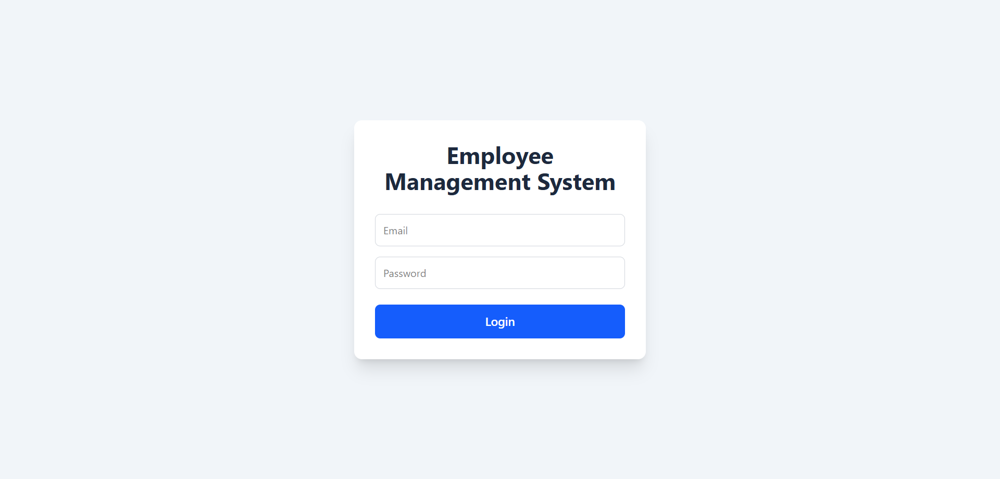
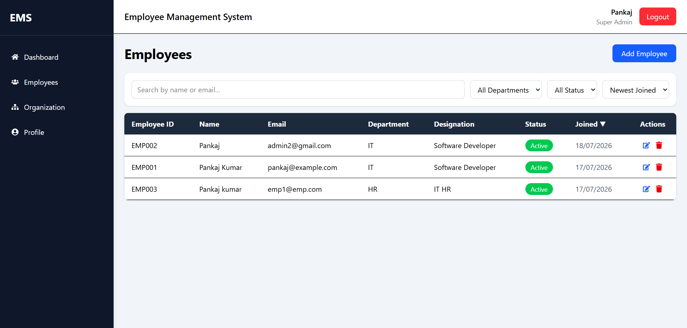

# Employee Management System (EMS)

A full-stack Employee Management System built for a job application assignment. Backend handles auth, employee CRUD, filtering/sorting/pagination, dashboard stats and organization hierarchy. Frontend is a React admin panel that consumes all of it.

Built by Pankaj Kumar.

---

## Why I built it this way

I split this into two completely independent apps — `server` and `client` — instead of a monorepo, mainly because I wanted to deploy them separately without dragging in extra tooling (Turborepo/Nx felt like overkill for a project this size). The backend was built first and fully tested with Thunder Client before I touched a single line of frontend code, so every API contract below is something I actually hit and verified, not just planned on paper.

A couple of design decisions worth calling out since they weren't in the original assignment brief but came up while building:

- **Employee IDs are auto-generated on the backend** (`EMP001`, `EMP002`...). I initially had this as a manual input field on the Add Employee form, but realized that's an easy way to end up with duplicate or badly formatted IDs, so I moved the generation server-side.
- **Circular reporting is blocked at the API level.** If you try to set Employee A as the manager of Employee B, while B is already (directly or indirectly) A's manager, the update gets rejected with a clear error instead of silently corrupting the hierarchy.
- **Role-based access isn't just cosmetic.** An "Employee" role account can only view/edit their own name and phone number — even if someone tries to hit the API directly with Postman/Thunder Client and pass a different `role` or `salary` in the body, the backend ignores it for non-privileged users.

---

## Tech Stack

**Backend**
- Node.js + Express.js
- TypeScript
- MongoDB + Mongoose
- JWT authentication
- bcrypt for password hashing
- express-validator for request validation

**Frontend**
- React 19 + TypeScript + Vite
- Tailwind CSS v4
- React Router DOM v7
- Axios (with interceptor for auto-attaching JWT)
- React Hook Form (form validation)
- React Hot Toast (notifications)
- Recharts (dashboard chart)
- React Icons

---

## Folder Structure

```
project/
├── server/
│   └── src/
│       ├── config/         # DB connection
│       ├── controllers/    # Route handlers
│       ├── middleware/     # auth, role, validation
│       ├── models/         # Mongoose schemas
│       ├── routes/
│       ├── utils/          # token gen, employeeId gen, seed script
│       └── validators/
│
└── client/
    └── src/
        ├── components/     # layout, employees, common (Pagination etc.)
        ├── context/        # AuthContext
        ├── pages/          # Login, Dashboard, Employees, Profile, etc.
        ├── routes/          # AppRoutes, PrivateRoute, RoleRoute
        ├── services/       # axios API calls
        └── types/
```

---

## Getting Started

### 1. Backend

```bash
cd server
npm install
```

Create a `.env` file in `server/`:

```
PORT=5000
MONGO_URI=your_mongodb_connection_string
JWT_SECRET=your_jwt_secret
```

Seed the first admin account (needed once, since there's no public registration — you can't create the first employee without already being logged in as one):

```bash
npm run seed
```

This creates:
```
email: admin@ems.com
password: Admin@123
```

Then start the server:

```bash
npm run dev
```

Runs on `http://localhost:5000`.

### 2. Frontend

```bash
cd client
npm install
npm run dev
```

Runs on `http://localhost:5173`. Open it, log in with the seeded admin credentials above.

---

## Roles

| Role | Access |
|---|---|
| Super Admin | Full access — dashboard, all employees, org hierarchy, create/edit/delete |
| HR Manager | Same as Super Admin currently (dashboard, employees, hierarchy) |
| Employee | Can only view and edit their own profile (name + phone). No dashboard/employee list access. |

---

## API Overview

Base URL: `http://localhost:5000/api`

| Method | Endpoint | Access | Description |
|---|---|---|---|
| POST | `/auth/login` | Public | Login, returns JWT + employee object |
| POST | `/employees` | Super Admin, HR | Create employee (ID auto-generated) |
| GET | `/employees` | Super Admin, HR | List employees — supports `search`, `department`, `status`, `sort`, `order`, `page`, `limit` |
| GET | `/employees/:id` | Super Admin, HR, or self | Get one employee |
| PUT | `/employees/:id` | Super Admin, HR, or self | Update employee (self-edit is field-restricted) |
| DELETE | `/employees/:id` | Super Admin, HR | Delete employee |
| GET | `/employees/hierarchy` | Super Admin, HR | Full manager-employee tree |
| GET | `/dashboard/stats` | Super Admin, HR | Total/active/inactive counts + department breakdown |

All protected routes require `Authorization: Bearer <token>`.

---

## Known Limitations / What I'd Add With More Time

- No soft-delete yet — deleting an employee is permanent (a `isDeleted` flag would be a quick fix)
- No CSV import/export
- HR Manager and Super Admin currently have identical permissions — in a real system HR probably shouldn't be able to, say, delete a Super Admin account
- No automated tests (Jest/Vitest) — everything was tested manually through Thunder Client and the UI
- Not deployed yet — running locally only for this submission

---

## Screenshots

### Login


### Dashboard


### Employees Page


### Organization Hierarchy
